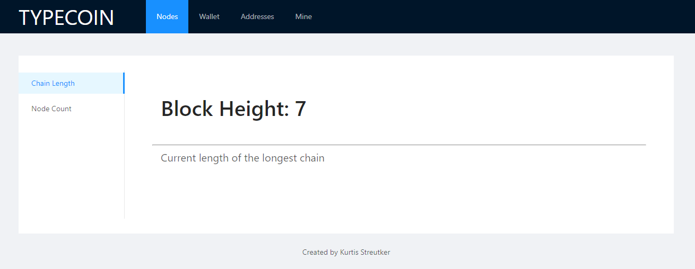

# TypeCoin

[](https://travis-ci.com/SC4RECOIN/TypeCoin)

A POS cryptocurrency written in Typescript

## scripts

Install dependencies  
```npm setup```  
Run p2p node and http API  
```npm blockchain```  
Run blockchain with react interface  
```npm all```  
  
Run unit tests  
```npm test```  
